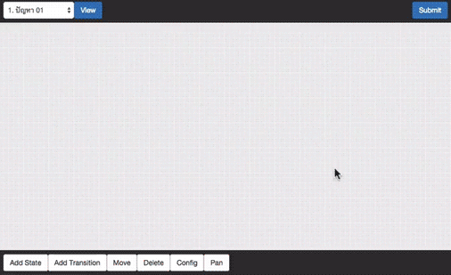

# compute-webprog

Compute is an experimental web application project. We try to buid a GUI Turing Machine drawer, simulator, and grader. You can draw a state diagram of turing machine by using mouse. Then, you can test your Turing Machine by submitting to the grader.

 (currently Thai language only, Sorry)

Stack
- PHP
- React.js

Author
- Nuttapon Pattanavijit (nuttt)
- Nasakol Pongkorpsakol (nasakol)

Note: our code is very mess since it's our first time using React.js

## Screenshot

## APIs

### `GET apis/challenges` - Get problems list

### `GET apis/challenges?id=1` - Get problem

### `POST apis/submit` - Submit challange

**Request**

	{
		id: 1,
		turing: {
			states: [
				{
					id: "2ajdkci23",
					type: "<state, accepted, rejected, start>"
				},
				{...}
			], 
			transitions:  [
				{
					from: "f23jl0d",
					input: "z"
					to: "f3lml90",
					write: "x",
					direction: "<S, L, R>"
				}
			]
		}
	}

**Response**

	Case: Right
	{
		status: right
	}

	Case: Wrong
	{
		id: 1,
		input: "0111010101 110101110",
		expected: "<1010101011101, accepted, rejected>",
		actual: "<010101011101, accepted, rejected, loop>",
		status: wrong
	}
	
	In case the answer is on the tape, there will be another field 'message'
	Example:
	{
		id: 1,
		input: "0111010101 110101110",
		expected: "010101011101",
		actual:   "010101011101",
		status: wrong,
		message: "Tape pointer must be before the leftmost of content on the tape"
	}
	
	
## PHP Classes

## Databases

### compute_challenges

- id: integer, auto_incr (PK)
- name: string
- description: text
- output: string (tape or yesno)

### compute_example_testcases

- id: integer, auto_incr (PK)
- challange_id: integer (IDX)
- testnum: integer (IDX)
- input: string
- expected: string

### compute_testcases

- id: integer, auto_incr (PK)
- challange_id: integer (IDX)
- testnum: integer (IDX)
- input: string
- expected: string
